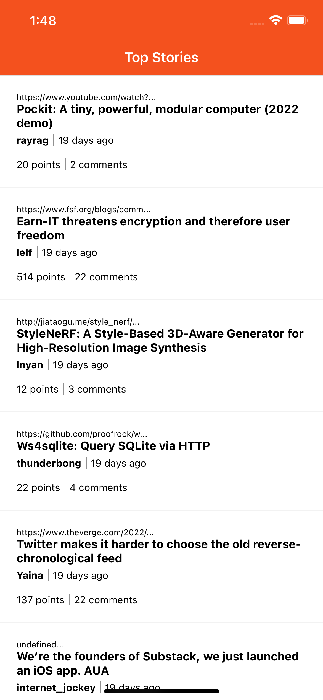
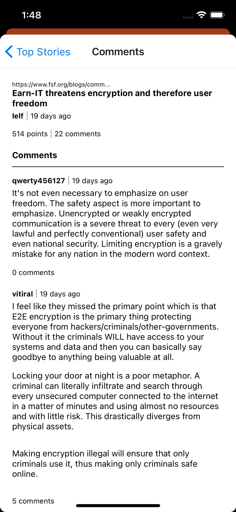
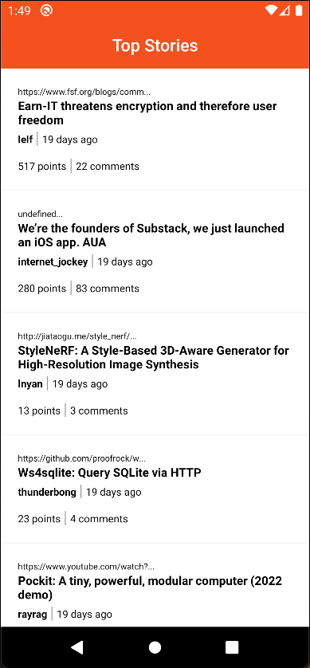
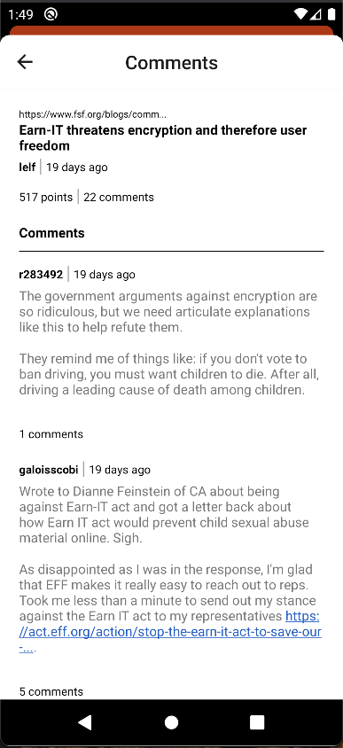

# HackerNews

Hackernews App

  
   

  
   

## Before you start

You need to setup following environment in your system to run react-native project.

  
- follow the instructions at https://facebook.github.io/react-native/docs/getting-started.html.

- Install Java 8 and set its path globally in your system [Link](https://www.java.com/en/download/help/download_options.xml)

- Download and install Android studio and set its SDK path globally in your system [Link](https://developer.android.com/studio/)

- Download and install node v12.X.X [Link](https://nodejs.org/en/blog/release/v12.13.0/)

- Install Android Studio [Link](https://developer.android.com/studio/)

- Install Xcode (Mac Only)

- Download and install Watchman (Mac Only) using `brew install watchman`

- Install react-native-cli using `npm install -g react-native-cli`

- Download and install VSCode editor [Link](https://code.visualstudio.com/download)

 

## Versioning for tool

- React native : 0.67.3

- Node : 12.x.x

- NPM : 6.12.0

- Android studio : 3.8 above

- Xcode : 12 and above

  
## Code clone and test the setup

- iOS Xcode all set up e.g. you can build and run a sample app.

- Android SDK all set up e.g. you can build and run a sample app.

- Clone the project from the respective repo

- Go in to folder `hacker_news_app` by `cd hacker_news_app`, install npm by `npm install` and then run `npx react-native run-ios`
  

## Getting started for Android

- Create on file inside android folder with name `local.properties` mention your sdk path following way `sdk.dir=path of your sdk `

- Now run Android application using `npm run`

- In case `Metro Bundler` does not start automatically so use `npm start` to start npm in your system
 

## Getting started for iOS

- Open HackerNews.xcworkspace and run project from Xcode

- In case `Metro Bundler` does not start automatically so use `npm start` to start npm in your system

 

## Tips
  
If you get an error after getting the latest with "git pull", then you might need to do some manual intervention due to whatever was just changed:

- Try "npm install" to get latest packages.

- If your you are getting confusing errors building/running from your IDE, try to do it from the command line to see if you can see errors more obviously. E.g. 'npx react-native run-ios'.

- To change environment use 'npm run env:prod or npm run env:uat'.

 

## Troubleshooting Guide 
if you face some problems you can follow the below steps:

1) When getting the error that metro server not connected, go to the parent reactnative folder: 

For iOS: 
`npm start --reset-cache`

For Android Device: 
`adb reverse tcp:8081 tcp:8081` 
`npm start --reset-cache`

2) If you encounter an error in iOS regarding the xcode app version, run following command:

`sudo xcode-select --switch /Applications/Xcode.app`

make sure you have the application name as "Xcode" and it is placed inside Applications directory. 

Do not use names like "XCode 11"

*Following notes from : [https://facebook.github.io/react-native/docs/getting-started]()

 